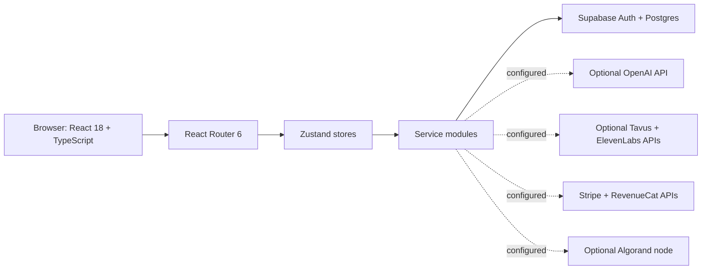

# VitaNest

VitaNest is a React and TypeScript health-companion web application. It brings account access, a health dashboard, profile management, medication and appointment tracking, a health chat interface, community pages, and billing screens into one browser-based app.

> **Prototype notice:** VitaNest is not a medical device or a substitute for professional care. The repository does not establish HIPAA compliance, clinical validation, end-to-end encryption, or production-grade payment security. Do not enter real patient data or use this application for clinical decisions.

<details>
<summary>Hosted demo</summary>

[Open the VitaNest demo](https://vitanestsatvikpandey.netlify.app/)

</details>

## Project at a glance

| Measure | Current repository |
| --- | --- |
| Source files under `src/` | 35 |
| Component files | 21 |
| Declared route entries | 3 public paths plus the protected `/app/*` route |
| Protected feature pages | 7: dashboard, chat, medications, appointments, profile, settings, billing |
| Supabase migration files | 6 |
| Direct runtime dependencies | 16 |
| Direct development dependencies | 14 |
| Automated test script | Not configured |

Counts describe the checked-in project structure and exclude transitive dependencies.

## Features in the codebase

- **Authentication and routing:** Supabase email/password sign-up and sign-in, session initialization, and protected application routes.
- **Health workspace:** dashboard, profile, medication records, appointments, settings, and billing views.
- **Chat:** messages are stored through the Supabase service. Chat replies use a local keyword/health-knowledge fallback; an optional OpenAI API call is attempted when configured. This is not a clinically validated model.
- **Voice and generated media:** browser speech synthesis is used for spoken responses; optional ElevenLabs and Tavus service clients are present.
- **Payments and subscriptions:** Stripe and RevenueCat client integrations and related screens are present. Their presence does not mean production payment processing is safely configured.
- **Algorand integration:** an SDK client and health-data contract helper are present. A reachable Algorand node and configured application ID are needed for blockchain operations; this is not required to load the main web app.
- **Public pages:** home and community pages are available without signing in.

## Architecture



The app is a Vite single-page application. `src/App.tsx` defines the route tree; Zustand stores hold authentication, health, and payment state; service modules call Supabase and optional third-party APIs. The current integrations run from browser code rather than a trusted application server.

## Technology

- React `18.3`, TypeScript `5.5`, Vite `5.4`
- React Router `6.26`, Zustand `4.5`
- Tailwind CSS `3.4`, Framer Motion `11`, Lucide React `0.344`
- Supabase JS `2.39`, Stripe JS/React Stripe JS `2.x`, Algorand SDK `2.7`
- Node.js 18 or later and npm

Dependency versions above are the declared package ranges in `package.json`; npm resolves exact versions from `package-lock.json`.

## Run locally

1. Install Node.js 18+ and npm.
2. Install the locked dependencies:

	```sh
	npm ci
	```

3. Create an untracked `.env.local` file with the configuration you need. Use your own project values; do not copy credential values from the checked-in `.env.example`.
4. Start the Vite development server:

	```sh
	npm run dev
	```

5. Open the local URL printed by Vite, normally `http://localhost:5173`.

### Environment variables

All variables prefixed with `VITE_` are bundled into browser-accessible code. They are not a secure place for private API credentials.

| Variable | Purpose |
| --- | --- |
| `VITE_SUPABASE_URL` | Supabase project URL |
| `VITE_SUPABASE_ANON_KEY` | Supabase publishable/anonymous client key; protect data with correctly configured Row Level Security (RLS) |
| `VITE_OPENAI_API_KEY` | Optional OpenAI chat completion request; currently called directly from the browser |
| `VITE_TAVUS_API_KEY` | Optional Tavus video-generation API |
| `VITE_ELEVENLABS_API_KEY` | Optional ElevenLabs text-to-speech API |
| `VITE_REVENUECAT_API_KEY` | RevenueCat subscriber and offering requests |
| `VITE_STRIPE_PUBLISHABLE_KEY` | Stripe browser SDK initialization |
| `VITE_STRIPE_SECRET_KEY` | Currently read by browser-side Stripe service code; **never set a real secret here**. Move secret-key operations to a trusted server before using payments. |
| `VITE_ALGORAND_TOKEN` | Algorand node access token |
| `VITE_ALGORAND_SERVER` | Algorand node host |
| `VITE_ALGORAND_PORT` | Algorand node port (defaults in code to `8080`) |

Some integrations have development fallbacks in source code. Missing variables do not imply that a third-party integration is configured or safe to use.

## Database

The Supabase service and SQL describe five application tables: `users`, `health_profiles`, `medications`, `appointments`, and `chat_messages`. The SQL schema enables RLS and defines per-user policies; confirm those policies against the deployed schema before connecting user data.

There are six SQL files under `supabase/migrations/`. Review them before applying anything. In particular, one migration contains `DROP TABLE` statements and can delete existing data. Use a disposable development project for schema experiments, back up any database with data, and do not run migrations blindly against production.

`SETUP_INSTRUCTIONS.md` refers to `supabase/complete_schema.sql`, but that file is not present in this repository. Treat that setup step as stale; use the checked-in migration files and a deliberate migration plan instead.

## Scripts

| Command | Description |
| --- | --- |
| `npm run dev` | Start Vite development server |
| `npm run build` | Build the production bundle with Vite (does not run a standalone TypeScript type-check) |
| `npm run preview` | Serve the generated build locally |
| `npm run lint` | Run ESLint across the project |

There is no test script or automated test suite configured in `package.json` at present.

## Security and deployment status

- **Rotate exposed credentials.** The committed `.env.example` and browser source contain credential-looking API values and hard-coded fallbacks. Assume any real credentials there are compromised; revoke and rotate them, remove the fallbacks, and keep replacements out of Git.
- **Keep secrets on a server.** Vite exposes `VITE_*` values in the client bundle. OpenAI, Tavus, ElevenLabs, RevenueCat, and Stripe secret-key requests should be proxied through a trusted backend or serverless functions. A Stripe secret key must never be shipped to a browser.
- **Review data protection.** RLS is present in SQL, but it does not by itself establish regulatory compliance, encryption at rest/in transit beyond provider defaults, or safe clinical use. Perform a security and privacy review before handling sensitive health information.
- **Treat blockchain helpers as experimental.** The current helper Base64-encodes data together with an address; Base64 is not encryption. Do not use this path for sensitive health data or assume an on-chain design meets privacy or deletion obligations.
- **Treat chat as informational only.** Responses can use hard-coded keyword guidance or an optional external model and may be inaccurate. They are not diagnosis or treatment recommendations.

The configured Netlify host returned HTTP 200 to a root-path `HEAD` request during documentation work. That confirms the host answered, not that every route, login flow, or third-party integration is currently operational.

